# Lab 8: Configure MCP Server for OCI Generative AI Agents

## Introduction

In this lab, you build on the earlier setup and extend the workflow to connect Oracle Autonomous AI Database Serverless with OCI Generative AI Agents through an MCP endpoint. This uses the Oracle Select AI Agent framework, an OCI Compute instance, OCI CLI authentication, and the OCI Agent Development Kit (ADK). You create the required cloud resources, configure secure access, install the required software, and run a Python script that allows the agent to call tools exposed through the Oracle Autonomous AI Database MCP Server.

This lab is designed for developers who want to use OCI Generative AI Agents to call tools defined using the Oracle Select AI Agent framework through Autonomous AI Database MCP server.

OCI Generative AI Agents is a fully managed Oracle Cloud service that combines large language models with AI technologies to create intelligent agents capable of orchestrating tools and services to address complex, multi-turn workflows. Agents can be configured with tools, such as those exposed through an MCP server, that they call dynamically to retrieve data or perform actions in response to natural language prompts.

The OCI Agent Development Kit (ADK) is a lightweight, client-side Python library that simplifies building agentic applications on top of OCI Generative AI Agents. In this lab, you use the ADK to write a Python client that registers the Autonomous AI Database MCP tools with your OCI Generative AI Agent, enabling it to answer questions about your database through natural language.

**Estimated Lab Time:** 40 minutes

### Objectives

In this lab, you will:
* Create an OCI Generative AI Agent and copy its endpoint OCID
* Generate SSH keys and provision an OCI Compute instance
* Configure OCI CLI API key authentication on the compute instance
* Install Python 3.12 and the OCI Agent Development Kit
* Generate a bearer token for the Autonomous AI Database MCP Server and run a Python client that connects the MCP endpoint to your OCI Generative AI Agent
* Validate agent responses for prompts

### Prerequisites

This lab assumes you have:
* Completed lab 1 - lab 3
* An Oracle Cloud account with permissions to create Generative AI Agents, Compute instances, VCN resources, and API keys
* Access to an Autonomous AI Database instance with an MCP endpoint
* Database credentials for generating the MCP bearer token
* PuTTY and PuTTYgen installed on your local machine, or equivalent SSH tooling

## Task 1: Create an OCI Generative AI Agent

In this task, you create the OCI Generative AI Agent and capture the agent endpoint OCID that you will later use in the Python sample.

1. In the OCI Console, select a region that supports Generative AI Agents, such as **US Midwest (Chicago)**.

2. Open the navigation menu, click **Analytics and AI**, and then click **Generative AI Agents**.
   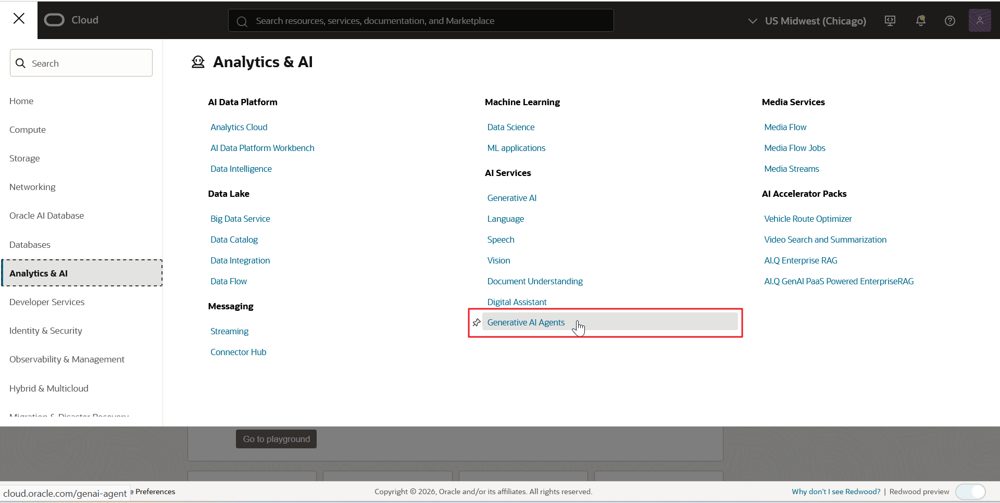

3. Under **Step 1: Create an agent**, click **Create agent**.

4. On the **Basic Information** page, enter a name for your agent, select your compartment, accept the default values for the remaining fields, and click **Next**.

    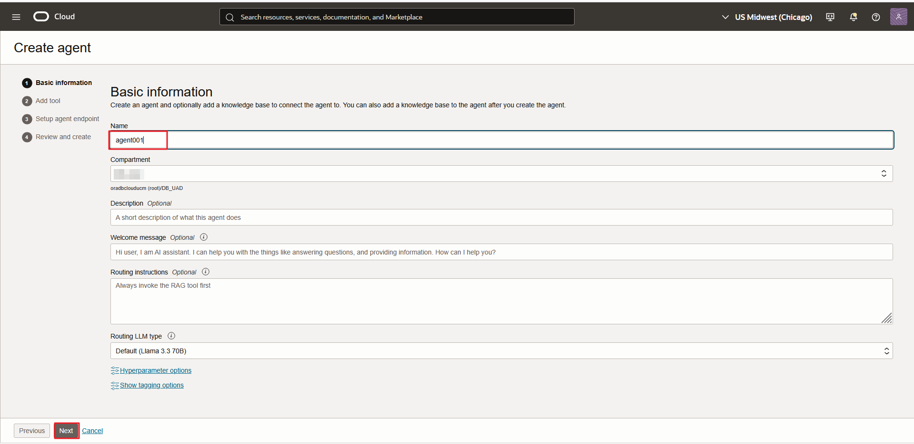

5. On the **Tools** page, click **Next**.
    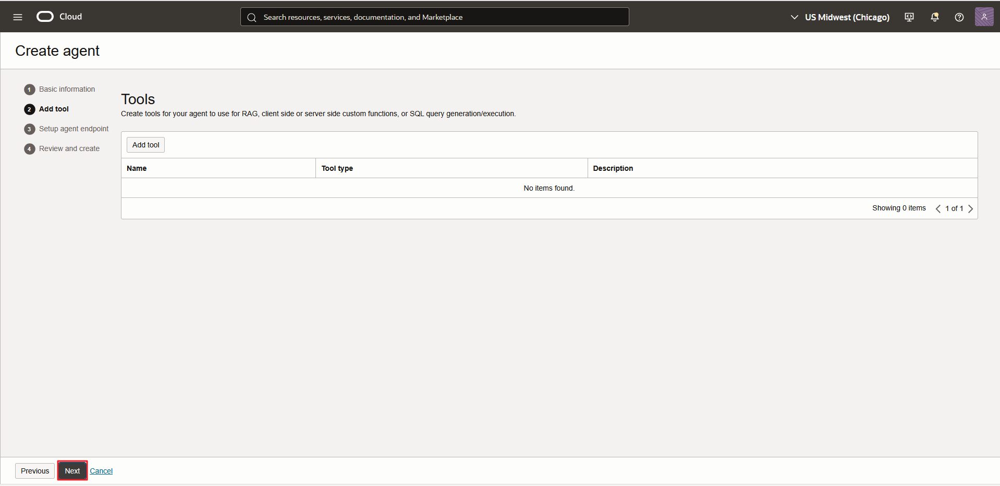

6. On the **Setup agent endpoint** page, accept the defaults and click **Next**.

    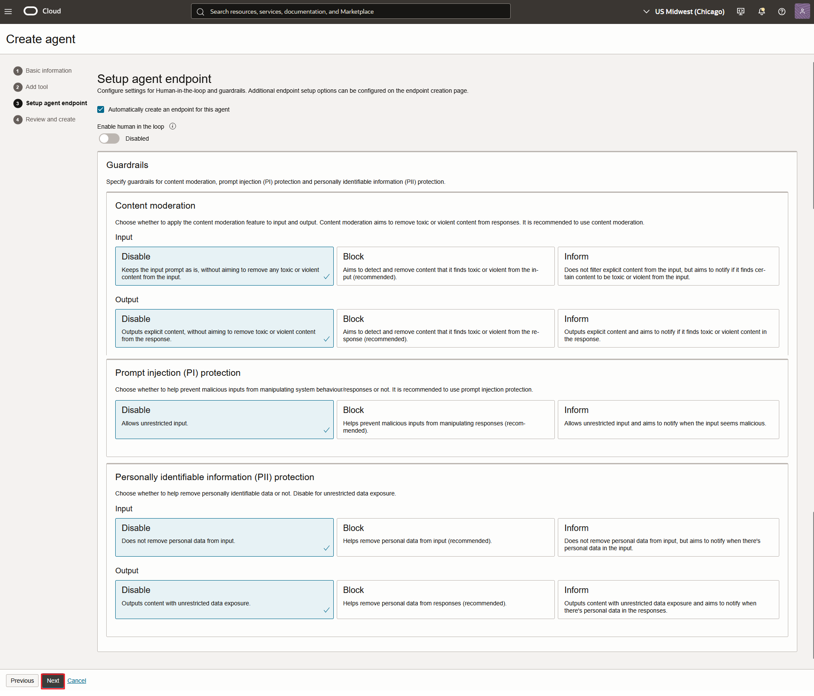

7. On the **Review and create** page, review the details and click **Create agent**.
    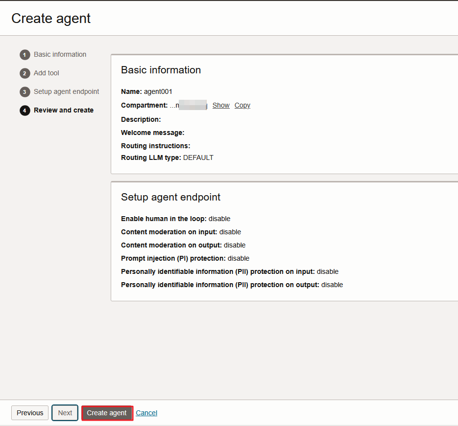

8. If you are prompted with an agreement or acceptable use policy, select **I accept** and click **Submit**.
    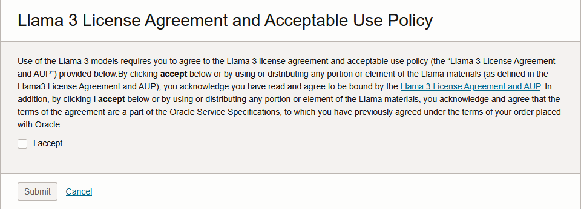

9.  Wait until the agent status changes to **Active**.

    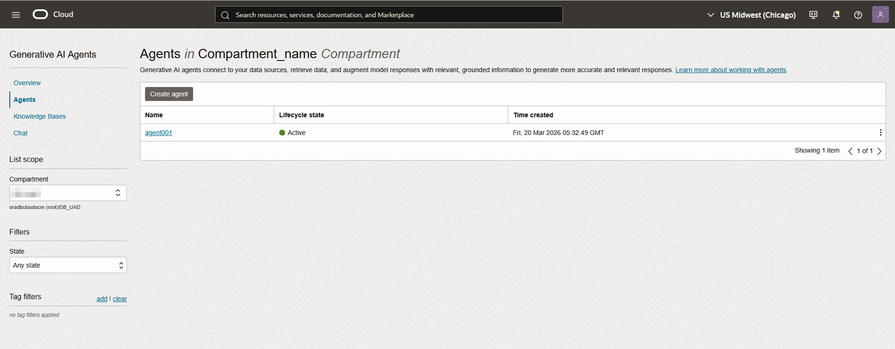

10. Click the agent name, scroll to the **Endpoints** section, click the three dots next to the endpoint, and then click **Copy OCID** or click the endpoint name and copy the OCID.
    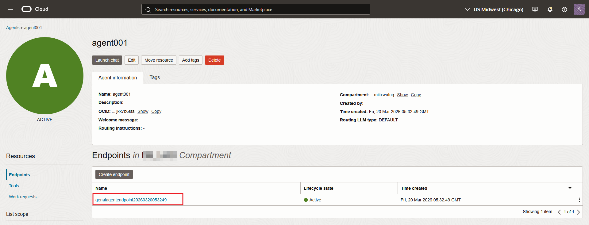

11. Save the endpoint OCID for later use.

    The expected output should look like:

    ```text
    Agent Endpoint OCID:
    ocid1.genaiagentendpoint.oc1.us-chicago-1.ama...
    ```

    > **Note:** You will paste this endpoint OCID into the Python sample later in this lab.

## Task 2: Generate SSH Keys with PuTTYgen

In this task, you generate the SSH key pair that you will use to connect to the OCI Compute instance.

1. Open **PuTTYgen** on your local machine.

2. Select the radio button for **EdDSA** and confirm that **Ed25519** is selected by default.

3. Click **Generate**.

4. Move your mouse in the blank area to provide entropy for the key generation process.

5. Save the private key as a `.ppk` file. You can set an optional passphrase.

6. Copy the public key text and save it for later use in the OCI Console.

    The expected output should look like:

    ```text
    Public key for pasting into OpenSSH authorized_keys file:
    ssh-ed25519 AAA...
    ```


## Task 3: Create an OCI Compute Instance

In this task, you create the OCI Compute instance that will host the OCI CLI, Python environment, OCI ADK, and sample Python script.

1. In the OCI Console, open the navigation menu, click **Compute**, and then click **Instances**.
   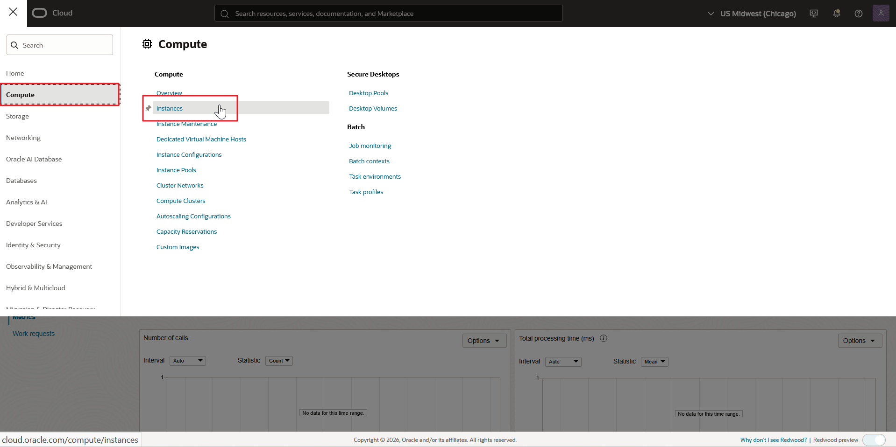

2. Click **Create instance**.

3. In **Basic Information**, enter a name for the instance and select your compartment.
   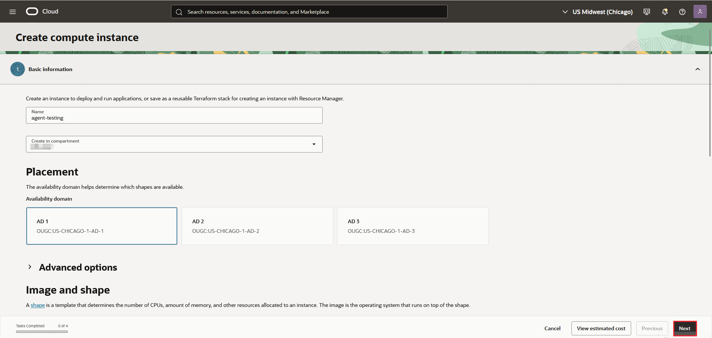

4. Accept the default values and click **Next** until you reach the **Networking** screen.

5. Under **Primary VNIC**, enter a value in the **VNIC name** field.
   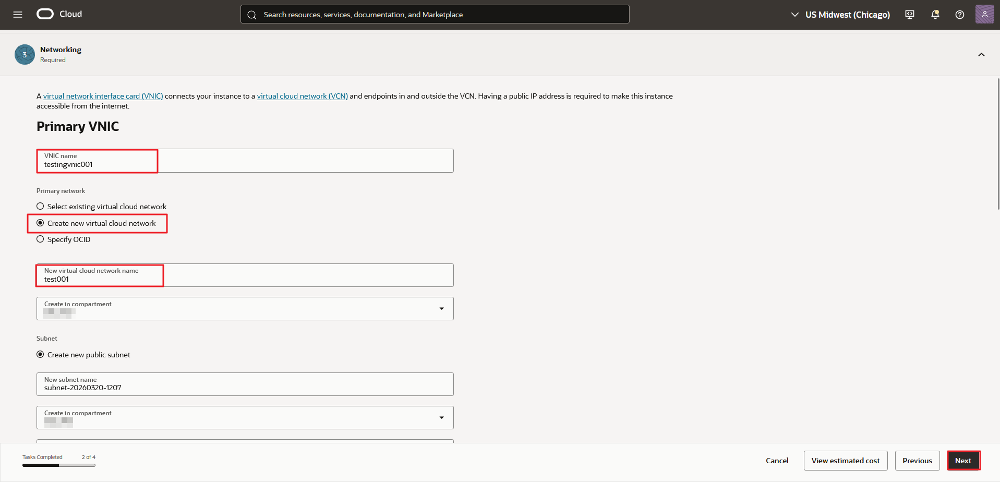

6. Select **Create new virtual cloud network**.

7. Enter a value in the **New virtual cloud network name** field and select your compartment.

8. Under **Subnet**, keep **Create new public subnet** selected.

9. Enter a value in the **New subnet name** field and confirm the compartment selection.

10. In the **Add SSH keys** section, select **Paste public key** and paste the public key you generated with PuTTYgen.

11. Continue through the remaining screens and accept the default values, review the details, and click **Create**.
    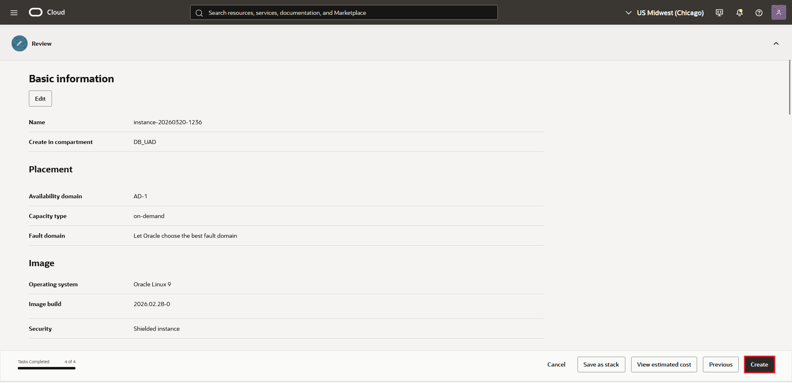

12. Wait until the instance state changes to **Running**, and then copy the public IP address.
    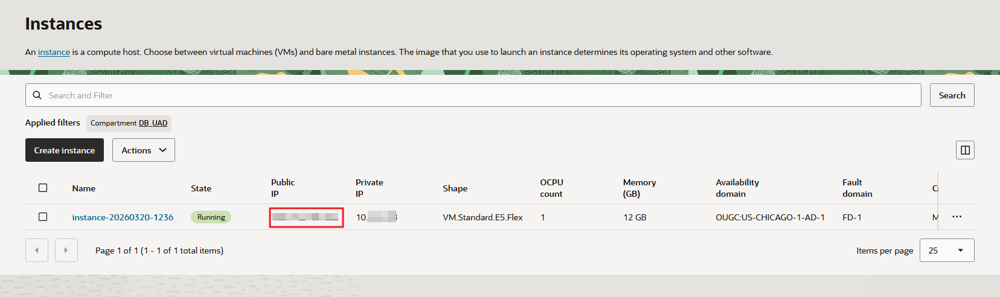


13. In the OCI Console, click the profile icon, open **User settings**, and copy the **User OCID**.

14. In the OCI Console, click the profile icon, click **Tenancy**, and copy the **Tenancy OCID**.

    The expected output should look like:

    ```text
    User OCID: ocid1.user.oc1..aaaaaaaaryd...
    Tenancy OCID: ocid1.tenancy.oc1..aaaa..
    ```
    >Note: You will use these values during the OCI CLI setup

## Task 4: Connect to the Compute Instance and Configure OCI CLI

In this task, you connect to the compute instance, update the operating system packages, install OCI CLI, and generate an API signing key pair.

1. Open **PuTTY**, load the connection to the compute instance public IP address.

    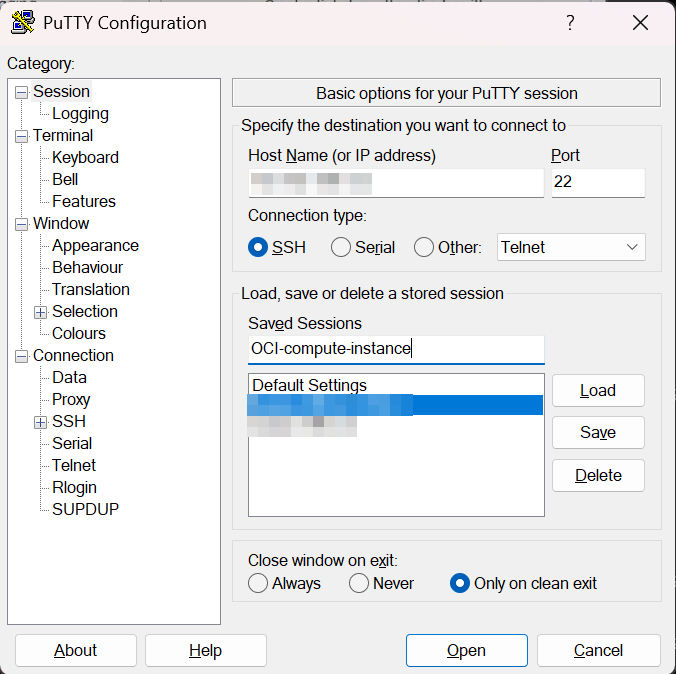

2. Optionally, set the keepalive time in seconds.
    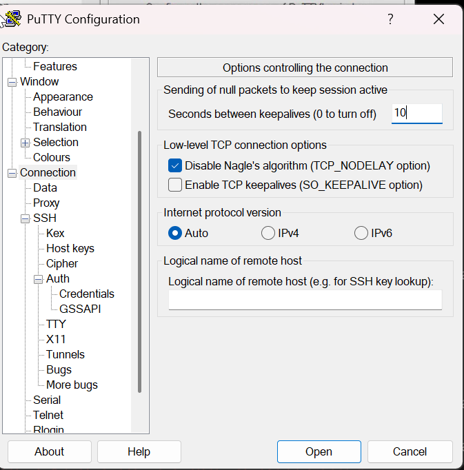

3. Navigate to Connection → SSH → Auth → Credentials and upload the private key that you generated using PuTTYgen.
    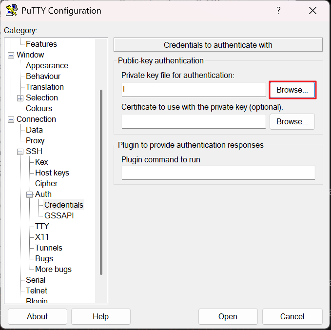

4. Save and connect to the compute instance public IP address and log in as the `opc` user.
   
5. Run the following command to update the instance packages before you install OCI CLI.

    ```bash
    <copy>
    sudo dnf update
    </copy>
    ```

    The expected output should look like:

    ```text
    Last metadata expiration check: ...
    Dependencies resolved.
    Is this ok [y/N]:
    ```

6. When you are prompted to install packages, enter `y`.

7. Run the following command to install the Oracle Linux developer release package.

    ```bash
    <copy>
    sudo dnf -y install oraclelinux-developer-release-e19
    </copy>
    ```

    The expected output should look like:

    ```text
    Installed:
      oraclelinux-developer-release-e19 ...
    Complete!
    ```

8. Run the following command to install OCI CLI exactly as provided.

    ```bash
    <copy>
    sudo dnf install python39-oci-cli
    </copy>
    ```

    The expected output should look like:

    ```text
    Dependencies resolved.
    Installing:
      python39-oci-cli ...
    Is this ok [y/n]:
    ```

9.  When you are prompted, enter `y`.

10. Run the following command to verify the OCI CLI installation.

    ```bash
    <copy>
    oci --version
    </copy>
    ```

    The expected output should look like:

    ```text
    3.x.x
    ```

11. Run the following command to start the OCI CLI configuration wizard.

    ```bash
    <copy>
    oci setup config
    </copy>
    ```

12. Respond to the prompts as follows:

       * For `Enter a location for your config [/home/opc/.oci/config]:` press **Enter**
       * For `Enter a user OCID:` paste your **User OCID**
       * For `Enter a tenancy OCID:` paste your **Tenancy OCID**
       * For `Enter the region ID:` enter `<your-gen-ai-region>`
       * For `Do you want to generate a new API Signing RSA key pair... [y/n]` enter `Y`
       * For `Enter a directory for your keys to be created [/home/opc/.oci]:` press **Enter**
       * For `Enter a name for your key [oci_api_key]:` press **Enter**
       * For `Enter a passphrase for your private Key ("N/A" for no passphrase):` enter `N/A`
       * For confirmation, enter `N/A` again

13. Run the following command to display the public key that you will add to your OCI user profile.

    ```bash
    <copy>
    cat /home/opc/.oci/oci_api_key_public.pem
    </copy>
    ```

    The expected output should look like:

    ```text
    -----BEGIN PUBLIC KEY-----
    ...
    -----END PUBLIC KEY-----
    ```


14. In the OCI Console, click your profile icon, click your name or email address, open the **Tokens and Keys** tab, go to **API Keys**, click **Add API Key**, select **Paste a public key**, paste the public key, and click **Add**.


## Task 5: Install Python 3.12 and Create the ADK Virtual Environment

In this task, you verify the installed Python version, install Python 3.12, create a virtual environment, and install the OCI ADK.

1. Run the following command to check the current Python version.

    ```bash
    <copy>
    python --version
    </copy>
    ```

    The expected output is:

    ```text
    Python 3.9.25
    ```

2. If the Python version is `3.9.25`, run the following command exactly as provided.

    ```bash
    <copy>
    sudo dnf config-manager --enable ol9_developer
    </copy>
    ```

    > **Note:** If you get an error you may skip this step.

3. Run the following command to install Python 3.12 and related packages.

    ```bash
    <copy>
    sudo dnf install -y python3.12 python3.12-devel python3.12-pip
    </copy>
    ```

    The expected output should look like:

    ```text
    Installed:
      python3.12
      python3.12-devel
      python3.12-pip
    Complete!
    ```

4. Run the following command to verify the installed Python 3.12 version.

    ```bash
    <copy>
    python3.12 --version
    </copy>
    ```

    The expected output should look like:

    ```text
    Python 3.12.x
    ```

5. Run the following command to create a virtual environment named `adk-env`.

    ```bash
    <copy>
    python3.12 -m venv adk-env
    </copy>
    ```

6. Run the following command to activate the virtual environment.

    ```bash
    <copy>
    source adk-env/bin/activate
    </copy>
    ```

    The expected output should look like:

    ```text
    (adk-env) [opc@instance ~]$
    ```

7. Run the following command to install the OCI ADK. This is the required installation step.

    ```bash
    <copy>
    pip install "oci[adk]"
    </copy>
    ```

    The expected output should look like:

    ```text
    Collecting oci[adk]
    Downloading ...
    Installing collected packages ...
    Successfully installed ...
    ```

8. If you are prompted, run the following command.

    ```bash
    <copy>
    pip install --upgrade pip
    </copy>
    ```

    The expected output should look like:

    ```text
    Requirement already satisfied or Successfully installed pip-...
    ```

    > **Note:** Do not replace `pip install "oci[adk]"` with `pip install --upgrade pip setuptools wheel`. The upgrade command is optional preparation. `pip install "oci[adk]"` is the required installation step for OCI ADK.

## Task 6: Generate the Bearer Token for the Autonomous AI Database MCP Server

In this task, you generate a bearer token for the Autonomous Database MCP endpoint and export it as an environment variable for the Python sample.

1. Return to your Autonomous Database MCP database details page and copy the **Database OCID**.

    The expected output should look like:

    ```text
        ocid1.autonomousdatabase.oc1.us-chicago-1.an...
    ```

2. Run the following command exactly as provided to generate the bearer token. See [**Lab 6 -> Task 3**](../configure-cline/configure-cline.md#task3bearertokenonlygenerateabearertokenusingcurl).

    ```bash
    <copy>
    curl --location 'https://dataaccess.adb.us-chicago-1.oraclecloudapps.com/adb/auth/v1/databases/ocid1.autonomousdatabase.oc1.us-chicago-1.anx.../token' \
      --header 'Content-Type: application/json' \
      --header 'Accept: application/json' \
      --data '{
        "grant_type":"password",
        "username":"hrm_user",
        "password":"QwertY#19_95"
      }'
    </copy>
    ```

3. Copy and store the `access_token` value in a text editor.
4. Run the following command to export the returned token as an environment variable.

    ```bash
    <copy>
    export MCP_BEARER_TOKEN="<access_token>"
    </copy>
    ```


## Task 7: Create and Run the Python Sample

In this task, you create the Python sample file, paste the provided code exactly as given, save it, and then run it.

1. Run the following command to create and edit `sample.py`.

    ```bash
    <copy>
    vi sample.py
    </copy>
    ```

2. Paste the following Python code exactly as provided or download the file [here](./files/sample.py). Replace your MCP endpoint and OCI Generative AI Agent endpoint only where the placeholders indicate and remove the angular `<>` brackets.

    ```python
    <copy>
    import os
    import asyncio

    from mcp.client.session_group import StreamableHttpParameters
    from oci.addons.adk import Agent, AgentClient
    from oci.addons.adk.mcp import MCPClientStreamableHttp
    from oci.addons.adk.run.types import RequiredAction, FunctionCall, PerformedAction


    async def async_input(prompt: str) -> str:
        """Non-blocking input that won't stall the async event loop."""
        loop = asyncio.get_event_loop()
        return await loop.run_in_executor(None, input, prompt)


    async def main():
        # Retrieve bearer token from environment for security
        bearer_token = os.environ.get("MCP_BEARER_TOKEN")
        if not bearer_token:
            raise RuntimeError("Bearer token environment variable (MCP_BEARER_TOKEN) not set.")

        # Set the remote MCP server endpoint
        params = StreamableHttpParameters(
            url="<mcp_end_point>",
            headers={
                "Authorization": f"Bearer {bearer_token}"
            }
        )

        # Create MCP client using Streamable HTTP transport
        async with MCPClientStreamableHttp(
            params=params,
            name="Streamable MCP Server"
        ) as mcp_client:

            # Set up AgentClient
            client = AgentClient(
                auth_type="api_key",
                profile="DEFAULT",
                region="us-chicago-1"
            )

            # Replace with your real Agent Endpoint OCID below
            agent_endpoint_id = "<agent_endpoint_ocid>"

            class InteractiveAgent(Agent):
                async def _handle_required_actions(
                    self,
                    response,
                    on_fulfilled_required_action=None,
                ):
                    required_actions = response.get("required_actions", [])
                    performed_actions = []

                    for action in required_actions:
                        required_action = RequiredAction.model_validate(action)

                        if required_action.required_action_type == "FUNCTION_CALLING_REQUIRED_ACTION":
                            function_call = required_action.function_call
                            print(f"Proposed tool: {function_call.name}")
                            print(f"With arguments: {function_call.arguments}")

                            # ✅ Use async_input instead of blocking input()
                            confirm = (await async_input("Should I execute this tool? (yes/no): ")).strip().lower()

                            if confirm == 'yes':
                                performed_action = await self._execute_function_call(
                                    function_call, required_action.action_id
                                )
                                if performed_action:
                                    performed_actions.append(performed_action)
                                if on_fulfilled_required_action:
                                    on_fulfilled_required_action(required_action, performed_action)
                            else:
                                print("Skipping tool execution.")
                                performed_actions.append(
                                    PerformedAction(
                                        action_id=required_action.action_id,
                                        performed_action_type="FUNCTION_CALLING_PERFORMED_ACTION",
                                        function_call_output="User denied execution."
                                    )
                                )

                    return performed_actions

            agent = InteractiveAgent(
                client=client,
                agent_endpoint_id=agent_endpoint_id,
                instructions="Use the tools to answer the questions.",
                tools=[await mcp_client.as_toolkit()]
            )
            agent.setup()
            print("Setup complete — ADB MCP tools registered with agent.")

            # ✅ Interactive bot loop using async_input
            while True:
                query = (await async_input("\nEnter your question (or 'quit' to exit): ")).strip()
                if query.lower() == 'quit':
                    break
                if query:
                    print(f"\nQuery: {query}")
                    response = await agent.run_async(query)
                    response.pretty_print()


    if __name__ == "__main__":
        asyncio.run(main())
    </copy>
    ```

3. Save and quit `vi`.

    ```bash
    <copy>
    :wq!
    </copy>
    ```


4. Run the following command to verify the active Python version. It must be greater than `3.10`.

    ```bash
    <copy>
    python --version
    </copy>
    ```

    The expected output should look like:

    ```text
    Python 3.12.x
    ```

5. Type the following command to run the sample Python file.

    ```bash
    <copy>
    python sample.py
    </copy>
    ```

    The expected output should look like:

    ```text
    Setup complete — ADB MCP tools registered with agent.

    Enter your question (or 'quit' to exit):
    ```

## Task 8: Validate Agent Queries Through the MCP Server

In this task, you verify that the agent can call tools exposed through the MCP server and respond to both in-domain and out-of-domain prompts.

1. At the prompt, enter the following query.

    ```text
    list the schemas in the database.
    ```

2. Review the output and approve the tool call when prompted.

    The expected output should look like:

    ```text
    Proposed tool: ...
    With arguments: ...
    Should I execute this tool? (yes/no): yes

    Schemas:
    ADMIN
    DATA
    HR
    HRM_USER
    ...
    ```


3. At the next prompt, enter the following query.

    ```text
    show all the departments
    ```

    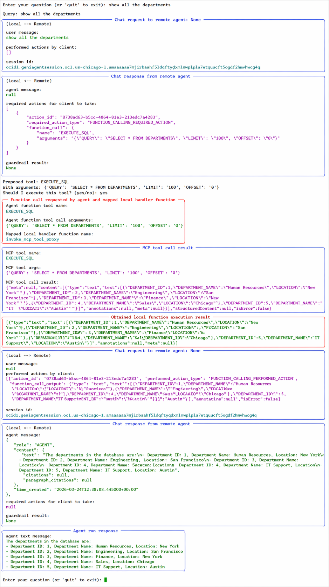

4. Review the returned output.

5. At the next prompt, enter the following query.

    ```text
    show me the roles in hrm_user schema
    ```

6. Review the result.


7. At the next prompt, try another unrelated question such as one of the following.

    ```text
    get me the objects of customers
    ```

    ```text
    Show me people from Mumbai
    ```

8. Observe how the agent responds to an unrelated or unsupported prompt.

    The expected output should look like:

    ```text
    I am not able to execute this task as it is out of domain.
    ```


## Quiz
```quiz score
Q: What do you copy from the OCI Generative AI Agent to use in the Python sample?

- The agent display name
* The agent endpoint OCID
- The compartment OCID
- The model OCID
>The Python sample uses the agent endpoint OCID to connect the OCI ADK client to your OCI Generative AI Agent.

Q: Which command installs the OCI Agent Development Kit in the virtual environment?

- pip install oci-adk
- pip install adk
* pip install "oci[adk]"
- python -m install oci[adk]
>The required installation step in this lab is `pip install "oci[adk]"`.

Q: What environment variable stores the MCP bearer token in this lab?

- OCI_BEARER_TOKEN
- ADB_TOKEN
* MCP_BEARER_TOKEN
- OCI_MCP_TOKEN
>The Python script reads the bearer token from the `MCP_BEARER_TOKEN` environment variable.

Q: Which user do you use to connect to the OCI Compute instance over SSH?

- root
- admin
* opc
- oracle
>You connect to the compute instance as the `opc` user.

Q: What should you type when the Python sample asks whether to execute the proposed tool?

- run
- approve
* yes
- continue
>When the script prompts `Should I execute this tool? (yes/no):`, type `yes` to allow the tool call.
```

## Troubleshooting
If the OCI Generative AI Agent, OCI CLI, Python client, or MCP tool calls do not work as expected, review the following checks:

*Issue 1: OCI CLI Setup Does Not Complete*

**Possible Causes**
- Incorrect user OCID or tenancy OCID
- Incorrect region identifier
- API key was not added to your OCI user profile

**Solution**

1. Run `oci setup config` again and verify each value that you enter.
2. Confirm that the region identifier matches the region where you created the OCI Generative AI Agent.
3. Display the public key again:
    ```
    cat /home/opc/.oci/oci_api_key_public.pem
    ```
4. In the OCI Console, confirm that the public key is added under **Tokens and Keys** for your user profile.
5. Run `oci --version` to verify that OCI CLI is installed.

*Issue 2: Python Version Is Lower Than 3.10*

**Possible Causes**
- Python 3.12 was not installed
- The virtual environment was not created with Python 3.12
- The shell is still using the default system Python

**Solution**

1. Check the current Python versions:
    ```
    python --version
    python3.12 --version
    ```
2. Install Python 3.12 again if needed:
    ```
    sudo dnf install -y python3.12 python3.12-devel python3.12-pip
    ```
3. Recreate the virtual environment using Python 3.12:
    ```
    python3.12 -m venv adk-env
    source adk-env/bin/activate
    ```
4. Run `python --version` again and verify that it is greater than `3.10`.

*Issue 3: Bearer Token Is Missing or Expired*

**Possible Causes**
- The bearer token was not exported
- The token value expired
- The token was copied incorrectly

**Solution**

1. Generate a new bearer token using the curl command in **Task 6**.
2. Copy the `access_token` value again.
3. Export the token:
    ```
    export MCP_BEARER_TOKEN="<access_token>"
    ```
4. Run the Python sample again.

*Issue 4: The Python Sample Does Not Connect to the MCP Endpoint*

**Possible Causes**
- The MCP endpoint URL is incorrect
- The agent endpoint OCID placeholder was not replaced
- The bearer token is invalid

**Solution**

1. Open `sample.py` and verify that you replaced `<mcp_end_point>` with your actual MCP endpoint URL.
2. Verify that you replaced `<agent_endpoint_ocid>` with your actual OCI Generative AI Agent endpoint OCID.
3. Confirm that the MCP endpoint URL uses the correct database OCID and region.
4. Verify that the `MCP_BEARER_TOKEN` environment variable is set in the current shell session.
5. Run:
    ```
    python sample.py
    ```

*Issue 5: Tool Calls Do Not Return the Expected Results*

**Possible Causes**
- You did not approve the proposed tool call
- The question is outside the supported database context
- The database objects expected by the prompt are not available

**Solution**

1. When prompted with `Should I execute this tool? (yes/no):`, type `yes`.
2. Retry with a database-focused prompt such as:
    ```
    list the schemas in the database.
    ```
3. Try another prompt from **Task 8**, such as `show all the departments`.
4. If a question is unrelated to the database context, expect the response to indicate that the task is out of domain.


## What to Learn More?

* [Creating an Agent in Generative AI Agents](https://docs.oracle.com/en-us/iaas/Content/generative-ai-agents/create-agent.htm)
* [OCI Agent Development Kit Quickstart](https://docs.oracle.com/en-us/iaas/Content/generative-ai-agents/adk/api-reference/quickstart.htm)
* [Creating an Instance](https://docs.oracle.com/en-us/iaas/Content/Compute/Tasks/launchinginstance.htm)
* [Configure MCP Server for OCI Generative AI Agents](https://docs.oracle.com/en/cloud/paas/autonomous-database/serverless/adbsb/use-mcp-server.html#GUID-2FB07D4E-4384-4126-9633-BB48C8F10886)

## Acknowledgements

* **Author:** Sarika Surampudi, Principal User Assistance Developer
* **Contributors:** Chandrakanth Putha, Senior Product Manager

